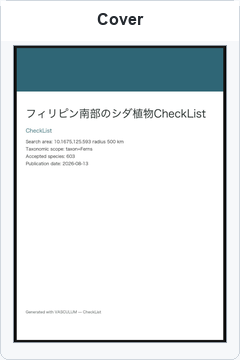
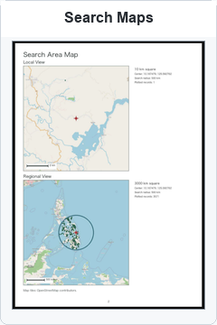
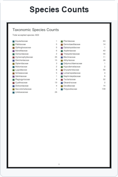
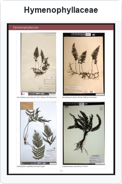
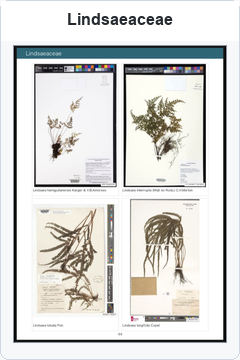
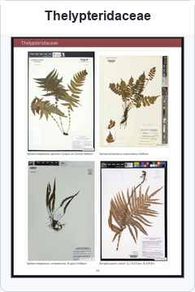
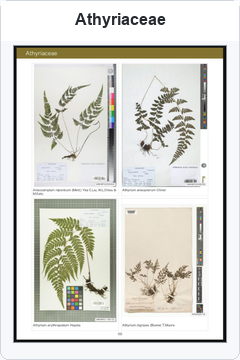
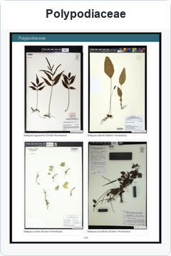
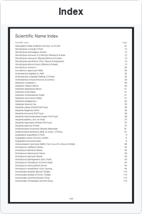

# VASCULUM

Version: `v0.1.13`

Repository: <https://github.com/yoneoka-katsuhiro/VASCULUM>

VASCULUM is a collection of pipelines for retrieving, curating, and organizing
digital herbarium specimen records and images.

The name refers to a vasculum, a portable botanical collecting case used to hold
plant specimens during fieldwork. This repository is intended to function as a
virtual vasculum for gathering, organizing, and holding digital herbarium
specimen data from multiple archives.

VASCULUM can also be read as:

```text
Voucher Archive Search and Curation for Unified Large-scale Use of Metadata
```

## Pipelines

| Directory | Purpose |
| --- | --- |
| `herbarium_specimen_collector/` | Retrieve and integrate Darwin Core (DwC)-oriented herbarium specimen datasets and associated specimen images from multiple digital archives. |
| `llm_georeference_curator/` | Perform LLM-assisted georeferencing from collector outputs, specimen-label evidence, and detailed locality strings while preserving reviewable coordinate candidates. |
| `checklist/` | Build species lists from geographic conditions and generate visual checklist PDFs from herbarium specimen records and images. |

## Setup

For normal use, download the release asset `VASCULUM-v0.1.13.zip` from GitHub
Releases. It expands to a clean `VASCULUM/` directory.

```bash
cd VASCULUM
bash setup_mac.sh
bash check_release.sh
```

The setup script prepares an isolated Python environment for each pipeline. The
release check runs syntax checks, offline tests, CLI smoke tests, and a basic
secret scan without sending specimen data to external services.

## Reusing Previous Outputs

Collector outputs from recent releases can be reused after updating VASCULUM.
Place each taxon directory under
`herbarium_specimen_collector/output/<taxon_name>/`, not at repository root.
When the collector is rerun on the same output directory, valid existing JPEGs
are checked and reused instead of being downloaded again. See
`herbarium_specimen_collector/README.md` for the full migration notes.

## Current Scope

The collector pipeline searches by scientific name, merges duplicate portal
records that represent the same physical specimen, downloads linked specimen
images, and writes DwC-oriented exports.

The LLM-assisted georeference curator reads those collector exports, preserves
reliable original coordinates, adds reviewable coordinate candidates, excludes
records with insufficient locality evidence, and writes modified DwC exports
for downstream analysis.

The CheckList pipeline reverse-searches species from a country or
coordinate-radius condition, selects representative herbarium specimen images,
and renders a visual checklist PDF with provenance tables for review.

## CheckList Example Gallery

Example output from a southern Philippines fern test run. The run covered 603
accepted species and completed in 4 h 14 min on a household Mac mini.

Scroll horizontally to browse the example pages. Click a card to open the full
page image.

<table>
  <tr>
    <td width="240" align="center" valign="top"><a href=".github/assets/checklist-gallery/philippines_fern_checklist_cover.png"></a></td>
    <td width="240" align="center" valign="top"><a href=".github/assets/checklist-gallery/philippines_fern_checklist_search_maps.png"></a></td>
    <td width="240" align="center" valign="top"><a href=".github/assets/checklist-gallery/philippines_fern_checklist_species_counts.png"></a></td>
    <td width="240" align="center" valign="top"><a href=".github/assets/checklist-gallery/philippines_fern_checklist_hymenophyllaceae.png"></a></td>
    <td width="240" align="center" valign="top"><a href=".github/assets/checklist-gallery/philippines_fern_checklist_lindsaeaceae.png"></a></td>
    <td width="240" align="center" valign="top"><a href=".github/assets/checklist-gallery/philippines_fern_checklist_thelypteridaceae.png"></a></td>
    <td width="240" align="center" valign="top"><a href=".github/assets/checklist-gallery/philippines_fern_checklist_athyriaceae.png"></a></td>
    <td width="240" align="center" valign="top"><a href=".github/assets/checklist-gallery/philippines_fern_checklist_polypodiaceae.png"></a></td>
    <td width="240" align="center" valign="top"><a href=".github/assets/checklist-gallery/philippines_fern_checklist_index.png"></a></td>
  </tr>
</table>

## SpecimenCollector Workflow

Use `herbarium_specimen_collector/` to retrieve Darwin Core-oriented specimen
records and linked herbarium specimen images.

```bash
cd herbarium_specimen_collector

bash run_collect_specimens.sh --dry-run \
  --taxon "Haplopteris mediosora"

bash run_collect_specimens.sh --skip-images --limit 10 \
  --taxon "Haplopteris mediosora" \
  --synonym "Vittaria mediosora"
```

Once the trial succeeds, drop `--skip-images` and `--limit` for a full run.
The collector writes `dwc.csv`, `dwc.tsv`, `summary.txt`, and linked files
under `images/`.

See `herbarium_specimen_collector/README.md` for source selection, image
resolution, duplicate handling, and output reuse.

## Georeference Workflow

Use `llm_georeference_curator/` to review and improve coordinates from an
existing collector output directory.

```bash
cd llm_georeference_curator

bash run_llm_georeference_curator.sh \
  --input ../herbarium_specimen_collector/output/Haplopteris_mediosora \
  --robust \
  --habitat "subalpine forest" \
  --limit 10 \
  --llm-mode on
```

The curator reads `dwc.csv` or `dwc.tsv` and local specimen images, then writes
`modified_dwc.csv`, `modified_dwc.tsv`, `georeference_candidates.tsv`,
`summary.txt`, and `georeference.log.jsonl`.

See `llm_georeference_curator/README.md` for LLM provider setup, habitat
constraints, caching, parallel processing, and review notes.

The collector and curator can be connected with `run_collect_and_georeference.sh`
when a single combined command is useful, but the two workflows are usually
easier to understand and check independently.

## CheckList Workflow

Use `checklist/` to build a species list from a geographic condition and render
a visual checklist PDF from herbarium specimen records and images.

First validate the configuration:

```bash
cd checklist
bash run_checklist.sh --dry-run \
  --country "Japan" \
  --taxon "Ferns"
```

### A. Administrative-Area Search

Use administrative fields such as `--country`, `--state`, or `--prefecture`
when the target area is a named region:

```bash
bash run_checklist.sh \
  --country "Japan" \
  --taxon "Aspleniaceae" \
  --title "Japan Aspleniaceae CheckList"
```

### B. Coordinate-Radius Search

Use latitude, longitude, and radius when the target area is a small field site
or locality. This is the recommended first real run:

```bash
bash run_checklist.sh \
  --country "Japan" \
  --latitude 35.303622 \
  --longitude 139.606166 \
  --radius 0.5 \
  --taxon "Ferns" \
  --title "Jimmuji Fern CheckList"
```

Very broad combinations, such as `--taxon "Angiosperms"` with a country-wide
search, can produce many species and substantially increase retrieval, image
processing, and LLM evaluation time. For routine work, use `--taxon` with a
family, genus, species, or small coordinate-radius search.

See `checklist/README.md` for taxon-scope examples, representative image
selection, output files, and citation guidance.

## Shared Files

`LICENSE` applies to the source code in this repository. `CITATIONS.md` lists
the public data services used by the configured adapters.

## Publication Notes

Local environments, API-key files, generated outputs, caches, macOS metadata,
and ZIP archives are excluded by `.gitignore`. Run `bash check_release.sh`
before staging a public release. The setup process does not initialize a Git
repository or publish any files.
