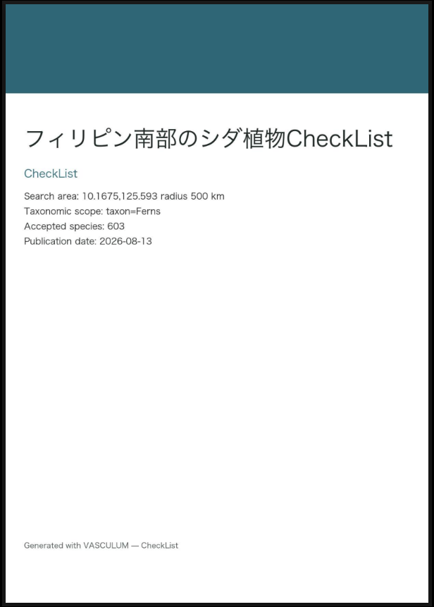
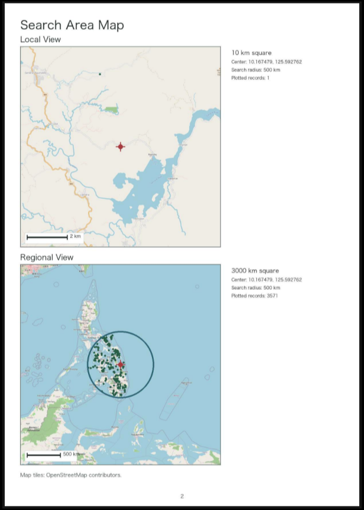
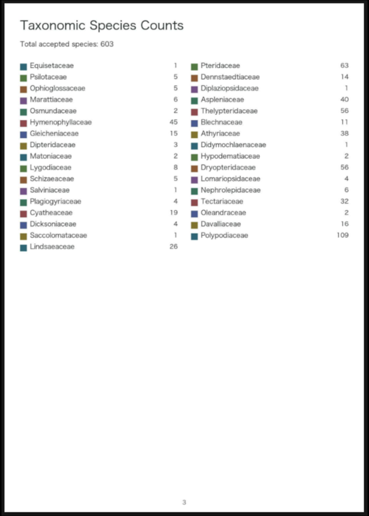
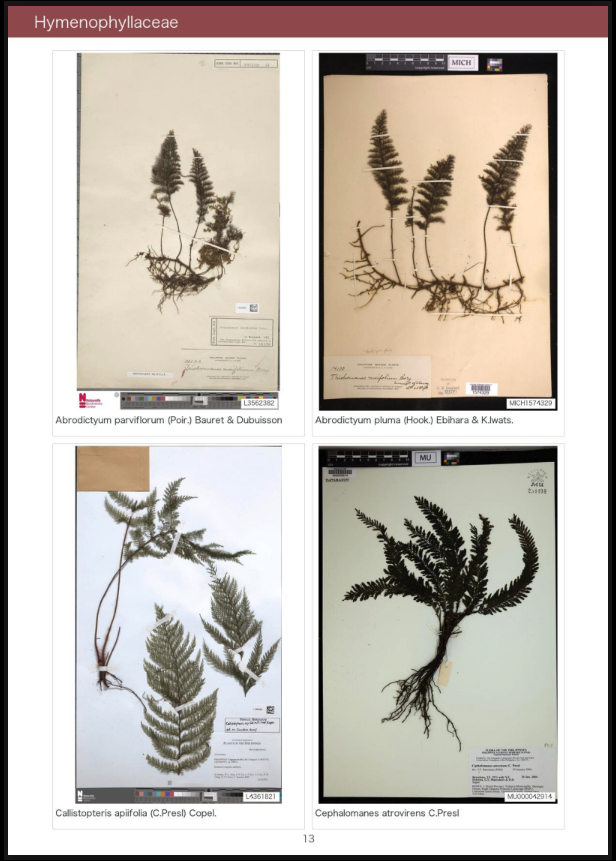
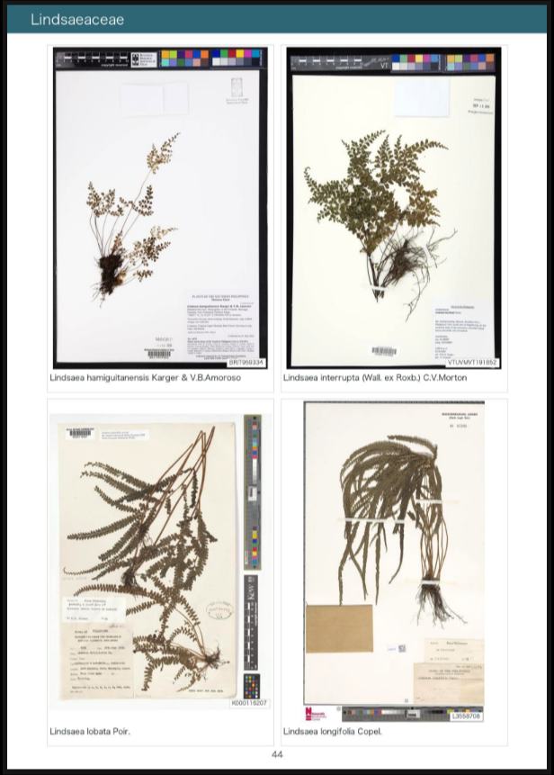
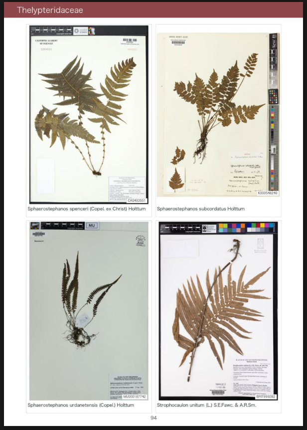
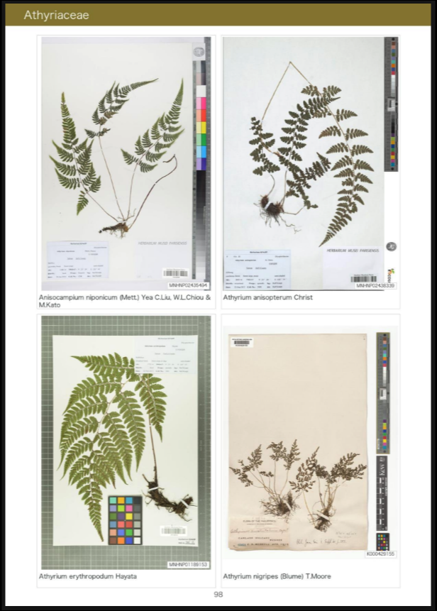
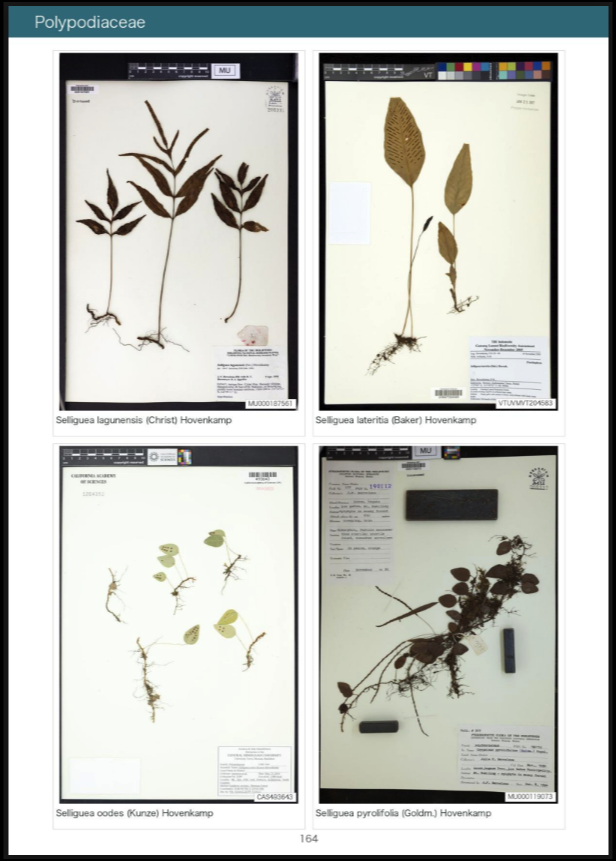
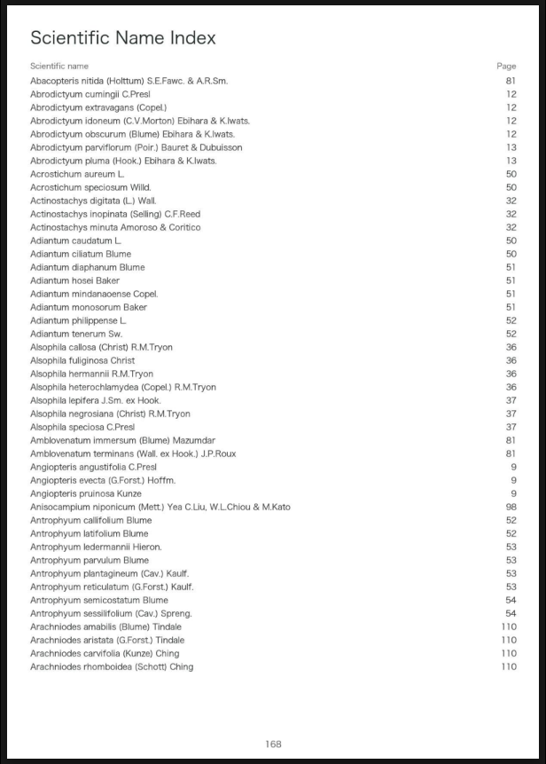

# CheckList

CheckList reverse-searches plant species from a geographic condition and
generates a visual checklist PDF from herbarium specimen records and images.

Version: `v0.1.2`

## Requirements

- macOS or Linux
- Python 3.9 or newer
- A contact email for polite HTTP identification
- Codex CLI access for AI-assisted specimen-image selection

## Setup

```bash
cd checklist
bash setup_mac.sh
cp .env.example .env
```

Set `CONTACT_EMAIL` in `.env`. The email is used only in the HTTP User-Agent
for polite database access. Do not commit `.env`.

## Recommended First Run

Confirm the configuration without touching the network first:

```bash
bash run_checklist.sh --dry-run \
  --country "Japan" \
  --taxon "Ferns"
```

For the first real run, start with a small coordinate-radius search. The
following example limits the search to 0.5 km around Jimmuji:

```bash
bash run_checklist.sh \
  --country "Japan" \
  --latitude 35.303622 \
  --longitude 139.606166 \
  --radius 0.5 \
  --taxon "Ferns" \
  --title "Jimmuji Fern CheckList"
```

This scale is better for checking setup and output structure than a broad
country-wide run. Increase the geographic area or taxonomic scope only after a
small run finishes as expected.

## Example Gallery

The gallery below shows a larger test output for ferns in the southern
Philippines. It covered 603 accepted species and completed in 4 h 14 min on a
household Mac mini. This is a demonstration of the final PDF, not the
recommended first run.

Scroll horizontally to browse the example pages.

<table>
  <tr>
    <td align="center" valign="top"><strong>Cover</strong><br></td>
    <td align="center" valign="top"><strong>Search maps</strong><br></td>
    <td align="center" valign="top"><strong>Species counts</strong><br></td>
    <td align="center" valign="top"><strong>Hymenophyllaceae</strong><br></td>
    <td align="center" valign="top"><strong>Lindsaeaceae</strong><br></td>
    <td align="center" valign="top"><strong>Thelypteridaceae</strong><br></td>
    <td align="center" valign="top"><strong>Athyriaceae</strong><br></td>
    <td align="center" valign="top"><strong>Polypodiaceae</strong><br></td>
    <td align="center" valign="top"><strong>Index</strong><br></td>
  </tr>
</table>

## Run

Administrative-area search:

```bash
bash run_checklist.sh \
  --country "Japan" \
  --taxon "Aspleniaceae" \
  --title "Japan Aspleniaceae CheckList"
```

Coordinate-radius search:

```bash
bash run_checklist.sh \
  --country "Japan" \
  --latitude 35.303622 \
  --longitude 139.606166 \
  --radius 0.5 \
  --taxon "Ferns" \
  --title "Jimmuji Fern CheckList"
```

Run `bash run_checklist.sh --help` for all options.

## Taxon Scope

Use one of these styles to limit the checklist:

```bash
# Major plant groups
--taxon "Ferns"
--taxon "Angiosperms"
--taxon "Gymnosperms"
--taxon "Lycophytes"
--taxon "Bryophytes"

# Family name
--taxon "Aspleniaceae"

# Genus name
--taxon "Hymenasplenium"

# Species name
--taxon "Asplenium nidus"
```

Large groups can produce many species. Broad scopes increase the number of
GBIF searches, image downloads, image checks, and Codex-assisted evaluations.
Avoid combining very large groups such as `Angiosperms` with broad geographic
areas unless you intentionally want a long run. For routine work, use `--taxon`
with a family, genus, species, or small coordinate-radius search.

## Representative Images

CheckList builds the species list from GBIF preserved-specimen occurrence
records. For each species, it searches GBIF herbarium specimen images first and
uses CVH only to add image candidates when GBIF has too few usable specimen
images.

Image candidates are filtered to remove failed downloads, duplicate images,
obvious placeholders, and records that are clearly not herbarium specimen
images. The Codex-assisted selector then chooses a representative specimen
image for each species when suitable candidates are available.

The final output includes the selected images, source/provenance tables, and a
visual checklist PDF.

## Geographic Searches

Use administrative fields such as `--country`, `--state`, or `--prefecture` to
search a named area. Use `--latitude`, `--longitude`, and `--radius` together
to search around a point.

For coordinate-radius searches, nearby specimen images are preferred when
available, but image distance is used for ranking rather than as an absolute
exclusion rule. This helps keep the checklist complete when local images are
missing.

## Output

Outputs are written to `output/checklist/<date>_<title>/` by default:

```text
species_list.csv
species_list.tsv
species_list.md
records.csv
checklist.pdf
summary.txt
```

The PDF contains a cover page, search-area maps, taxonomic species counts,
visual checklist pages, a scientific-name index, and a search/provenance page.

Use `--output PATH` to choose another output directory.

## Terminal And Exit Codes

Long-running stages print `running...` status lines and species-level progress
bars. A broad search may look slow because each species can trigger record
retrieval, image filtering, and optional Codex-assisted image evaluation.

- `0`: completed without retrieval or image errors
- `1`: fatal configuration or runtime error
- `2`: invalid command-line usage
- `3`: output completed, but one or more source or image operations failed
- `130`: interrupted by the user

## Research And Licensing

Metadata and images remain subject to the licenses and terms supplied by their
source datasets and institutions. Review `license`, `rightsHolder`,
`references`, and source record pages before publication or redistribution.
See `CITATIONS.md`.

The source code is released under the MIT License. Downloaded data and images
are not covered by the software license.
